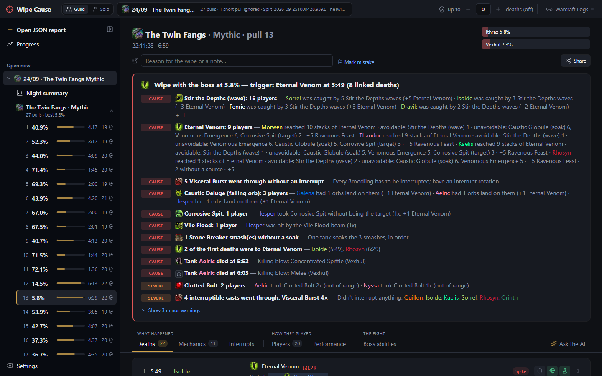
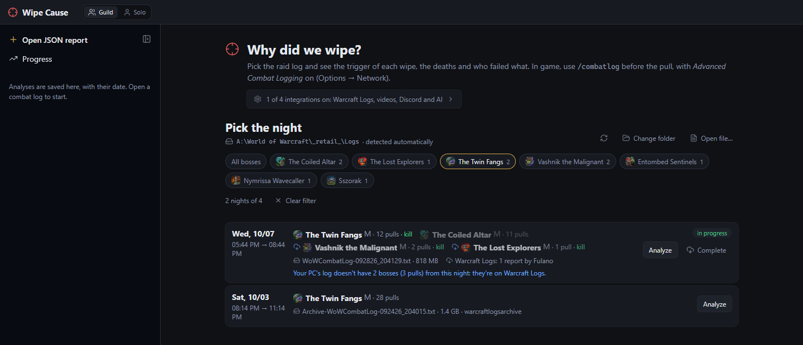
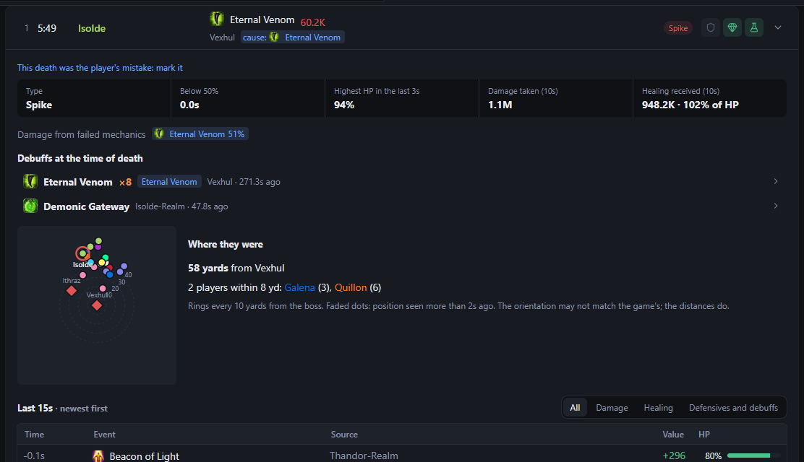
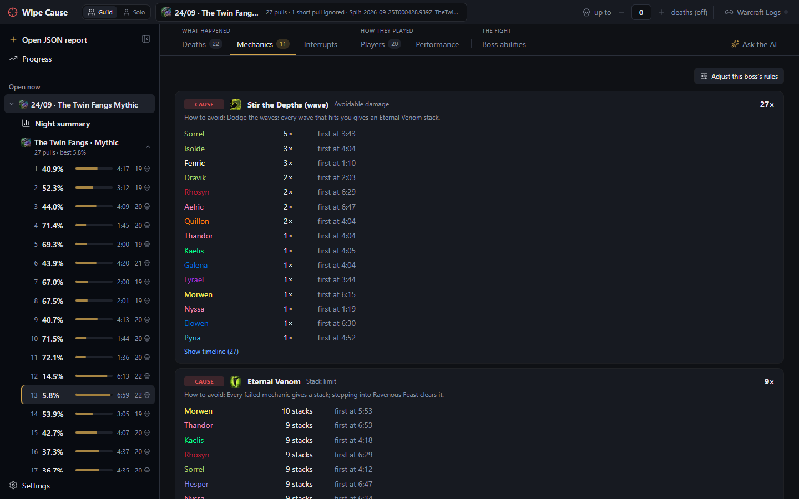
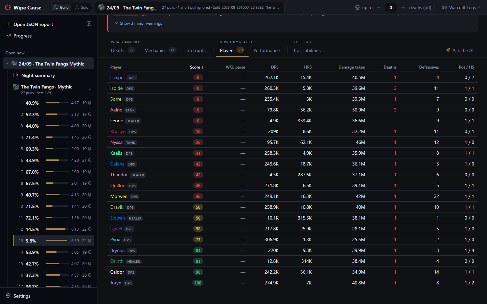
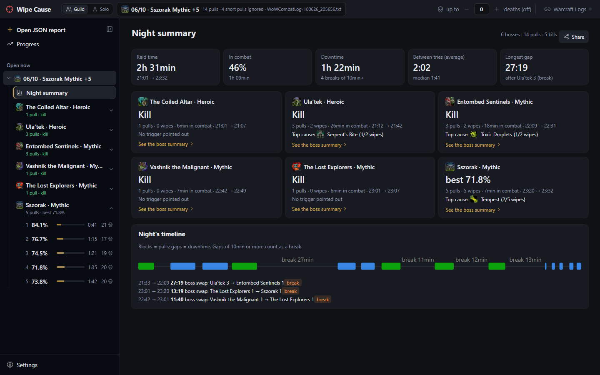
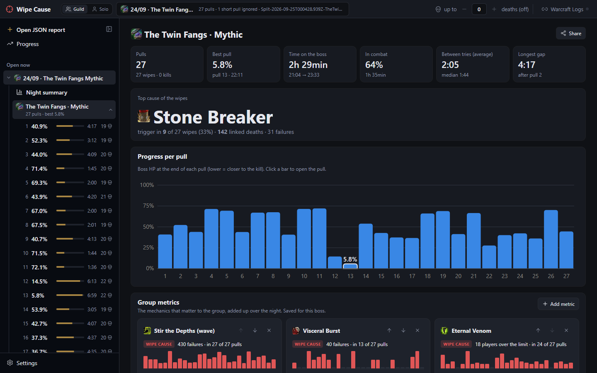
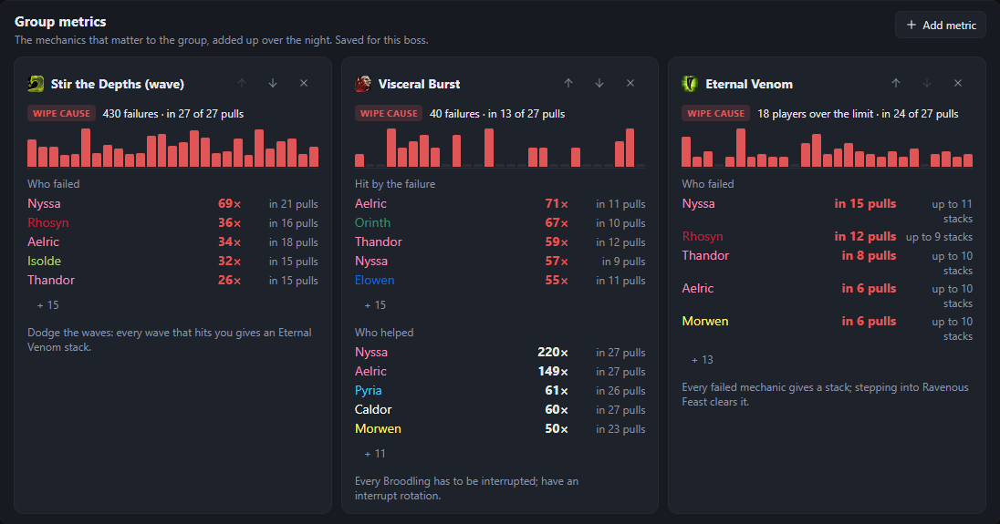
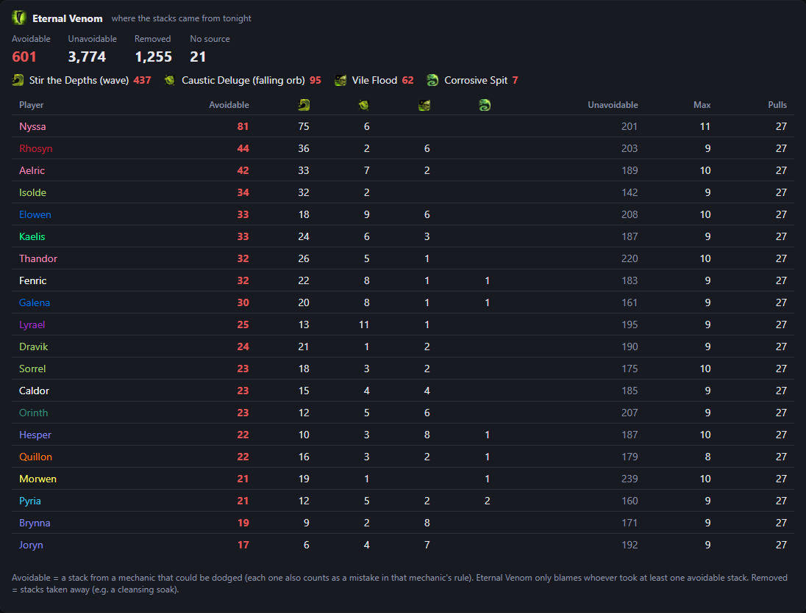
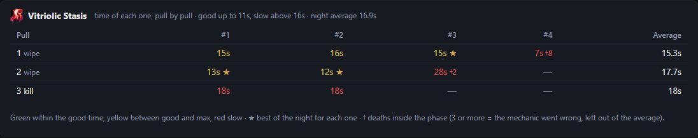

<p align="center">
  
</p>

<h1 align="center">Wipe Cause</h1>

<p align="center">
  <b>Find out why the try wiped.</b><br>
  Reads the World of Warcraft combat log straight from your PC and shows the wipe's trigger, every death and who failed what.
</p>

<p align="center">
  <a href="https://github.com/keter45/wipe-cause/releases/latest"></a>
  
  
</p>

<p align="center">
  <a href="https://github.com/keter45/wipe-cause/releases/latest/download/WipeCause_x64-setup.exe"></a>
</p>
<p align="center">
  <a href="https://github.com/keter45/wipe-cause/releases/latest">What's new</a>
  &nbsp;·&nbsp;
  <a href="README.md">Português</a>
</p>

<p align="center">
  
</p>
<p align="center"><i>A The Twin Fangs pull: the wipe's trigger, the mechanics that went wrong and who failed each one.</i></p>

<p align="center">
  <a href="#install">Install</a> ·
  <a href="#how-it-works">How it works</a> ·
  <a href="#night-and-boss-summary">Night and boss summary</a> ·
  <a href="#more-features">More features</a> ·
  <a href="#for-contributors">For contributors</a>
</p>

---

### 🎯 The wipe's trigger
The mechanic failure that set off the deaths, with the exact moment and who was involved. No more guessing on Discord after the raid.

### ☠️ Every death explained
Spike or slow death, missing healing, active debuffs, the killing blow, the defensives left unused and where the player was standing.

### 📊 The whole night on one screen
Progress pull by pull, the top cause of the wipes, the downtime between tries and the mechanics the group chose to track.

### 🔴 Live, between pulls
With live mode on, the reason for the wipe shows up seconds after the pull — and can go straight to the raid's Discord.

---

## Install

1. **[Download the installer](https://github.com/keter45/wipe-cause/releases/latest/download/WipeCause_x64-setup.exe)** (`WipeCause_x64-setup.exe`, ~4 MB).
2. Open the file. The first time, Windows may show *"Windows protected your PC"*: click **More info → Run anyway** (the app doesn't have a paid signing certificate yet).
3. Done. The app **updates itself** when a new version comes out; no need to download it again.

> [!TIP]
> There's no Wipe Cause server: everything runs on your PC. The Warcraft Logs account is optional and only used to see the guild's logs and fill in what your log missed.

### First steps

The first time, the app opens on **Settings** with a step-by-step guide (afterwards it lives in *Settings → How it works*):

1. **WoW logs folder** — found automatically on most PCs (`World of Warcraft\_retail_\Logs`).
2. **In game** — in *Options → Network*, turn on *Advanced Combat Logging*; before the first pull, `/combatlog` (or the Warcraft Logs uploader, which turns it on by itself).
3. **Sign in with Warcraft Logs** (recommended) — with your account the app sees your guild's logs, completes what your log missed, turns live mode on by itself and shows everyone's parse. No key or client to create.
4. **Optional** — turn live on when WoW opens (with the app closed, the game opens Wipe Cause minimized in the tray, already live; a light watcher with no window starts with Windows), Warcraft Recorder videos, Discord and AI.

## How it works

### 1. Pick the night


<p align="center"><i>One line per night, with each night's bosses. The filter shows only one boss's nights.</i></p>

**New analysis** brings together the logs on your PC and the guild's Warcraft Logs reports, one line per night. **Analyze** uses your PC's log (fast, no download); **Analyze all** reads one by one the logs in the list that haven't been analyzed yet and saves them in the history, for Progress. The logs folder includes the Warcraft Logs uploader's `warcraftlogsarchive`. Dungeon-only (M+) logs don't show up. **Guild / Pug** separates the guild raid from raids with other characters and random people: by the core of players that repeats across your nights (one log can have both, split boss by boss). To find a boss's nights, filter by it (and by difficulty) in the bar above the list; the choice is remembered.

Bosses and pulls that **aren't in your log** but are on Warcraft Logs (you left early, joined late, were away) show a download icon. **Complete** downloads only what's missing — it takes a few minutes, so you decide; after the first download, reopening is fast. Dungeons (M+) are left out, and wipes shorter than 30s are ignored.

### 2. See why you wiped

The top of the pull is the **verdict**: where the boss ended, the wipe's **trigger** (the mechanic failure that set off the deaths) and every mechanic mistake with who made it, from most to least severe (see the screenshot at the top of this page). Below it, the tabs:

| Deaths | Mechanics |
|---|---|
|  |  |
| Spike or slow death, missing healing, active debuffs (with stacks), killing blow, defensives/potion/healthstone and a mini map of where everyone was. | Each boss mechanic with who failed it, how many times, the first time and how to avoid it. |

- **Interrupts**: casts that went through, who kicked, who tried and missed, who could have and didn't — and, with the assignments pasted, whose turn it was.
- **Players**: damage done and taken, defensives, potions and each player's **score**.


<p align="center"><i>The 0–100 score takes off points for mechanic mistakes, a missed turn in the interrupt assignments and a decisive death.</i></p>

## Night and boss summary


<p align="center"><i>The night summary: raid time, downtime between tries, one card per boss and the timeline with the breaks.</i></p>

In the **boss summary**: the best pull, the top cause of the wipes, progress pull by pull, the villains and heroes scoreboard and the downtime.



### Group metrics

Pick the mechanics that matter to the group under **Add metric** (the ones that failed most come first). Each one becomes a card with the failures pull by pull — click a bar to open the pull —, who failed and who helped. You can reorder and remove them; the choice is saved for that boss.



### Where the stacks came from

For stacking debuffs, like Eternal Venom on The Twin Fangs, the app tells where every stack came from: the **avoidable** ones (waves, an orb landing on you, Vile Flood, the Corrosive Spit line), the unavoidable ones and the ones that were removed. The rule only blames whoever took an avoidable stack.



### Intermission times

Phases where the boss is immune until the raid solves the mechanic are timed pull by pull, with the best of the night for each one.



## More features

### 🔴 Live mode and Discord

With **Live** on (at the top), the app follows the most recent `WoWCombatLog` in the logs folder. Without WoW open on this PC and with a Warcraft Logs account, it follows the guild's live log (someone needs the uploader's *Live Logging* on); with *Turn live on by itself* (Settings → Warcraft Logs), it starts as soon as the guild starts the raid. When a pull ends, it re-analyzes the log in a few seconds, opens the new pull and shows a notification — you can see why you wiped before the next pull.

Closing the window leaves the app in the tray (near the clock) with live mode running; click the icon to bring it back and use **Quit** in the icon's menu to close it for good.

The pull notification has a field to note the reason for the wipe right away, the way the raid saw it (it doesn't disappear while you type). The note is saved on the PC, shows at the top of the pull (where you can edit it later), marks the pull in the list, goes on the share card and into the "Ask the AI" context.

In **Settings → Discord**, paste the raid channel's webhook. In live mode, everything arrives as an image (the same card as *Share*): on every wipe, the reason for the wipe; on every kill, the boss summary; and at the end of the raid (live turned off or 30 min with no new pull), the night summary. The pull, the boss summary and the night summary can also be sent right away through *Share*. The **Discord** button at the top pauses and resumes automatic posting without touching the options (*Share* keeps working).

### 📤 Share

The pull, the boss, the night, a player's performance and solo mode have **Share**: it builds a card to **copy as an image** and paste on Discord/WhatsApp, **save as PNG, HTML or PDF** or **send the image to Discord** through the configured webhook. Each card has two versions:

- **Summary** (default, and what goes out automatically in live mode): the essentials at a glance. For a pull, the verdict, the top 3 findings, the decisive deaths, who scored below 80 and the failure map; for a boss, each pull's HP, the top causes, who scored below 80 and the highlights; for solo, your numbers against the reference and the 3 most costly mistakes.
- **Full**: everything open, wider. Every death in order, the mechanics with who failed them, the interrupts that went through and the player table (pull); pull by pull and the scoreboard (boss and night); the stretches where the reference pulled ahead, cooldowns and extra damage taken (solo); rotation, potions and setup (performance).

### 🧮 Player score

Each player gets a 0–100 score per pull: it starts at 100 and loses points for:

- **mechanic mistakes**, by the rule's severity, up to 3 per mechanic. A tank's avoidable damage weighs half, since they often take it on purpose to hold or position the boss;
- **missing their own turn** in the interrupt assignments;
- **a decisive death**, more if they had a defensive left.

At the end it weighs the time alive until the first death and, on a kill, the **Warcraft Logs parse**: from 50 (the median) up it loses nothing; below it loses proportionally, up to 30% (parse 25 loses 15%). Wipes have no parse, so they skip this part. The parse is fetched once (with the night's report set and the Warcraft Logs account connected) and saved in the app. A death in a **mass wipe** (more than 5 deaths within 1.5s — explosion, Execution, enrage) doesn't count: it's a consequence of the wipe, and the blame goes to the mechanic and whoever caused it. It shows in the Players tab (hover to see the deductions), as an average on the boss scoreboard and per night in Progress.

### 🤖 Ask the AI

Every pull has an **Ask the AI** tab: the AI gets a dossier of the pull (the boss mechanics with the rules' tips, verdict, deaths, defensives, positions, interrupt assignments, dispels, notes and a summary of the night's other pulls — ~3–5k tokens) and answers only from it. You can read the dossier in **View dossier**.

It works with any provider using OpenAI's chat format, with presets for free options: **Google Gemini** and **Groq** (free plans with no card), **OpenRouter** (`:free` models) and **Ollama** (runs on your PC, free and offline), chosen in **Settings → Ask the AI**. The API key is kept in the Windows Credential Manager. On free plans, the provider may use the questions to train models — the dossier includes player names.

### ⚡ Performance

Each pull's **Performance** tab compares a player with the **top players of the same spec on Warcraft Logs**, with a similar item level (and a similar kill time, if the pull was a kill). In progression there's no kill time: the top's fight is cut at the same time the player stayed alive, so a 2:30 wipe is compared with the first 2:30 of the kill.

- **Burst windows**: pick the cooldowns to compare; each use shows the casts from 3s before to 20s after on a timeline, side by side with the same use by the top.
- **Cooldowns**: when each one was used, how many times (and how many fit in the time) and whether the 1st use came late or early.
- **Where the reference pulled ahead**: your damage every 5s against the reference's, with the 3 stretches with the biggest difference and each one's casts side by side.
- **Casts by ability**: casts per minute and % of damage per ability, and the reading of the [spec's base rotation](#-rotation).
- **Extra damage taken**: the boss abilities that hit you much more than the reference, per minute alive.
- **Setup**: combat potion, stat distribution, different talents and items side by side, with missing enchants and gems.
- **Export**: the player's report becomes a card to copy, save (PNG/HTML) or send to Discord — for people who don't have the app.

To use the tops, create a free client at [warcraftlogs.com/api/clients](https://www.warcraftlogs.com/api/clients/) and paste the client ID and secret in the tab (they're kept in the Windows Credential Manager). Queries only send the boss, spec and report codes; responses are cached. Comparing with your own raid lives in the **In your own raid** tab. If the night's report link is set, the pull also gets links to your fight on Warcraft Logs and WoWAnalyzer.

### 👤 Solo mode

At the top, **Guild / Solo** switches the app's focus. In guild mode, the question is why the raid wiped. In solo, it's how **you** can improve. "You" is whoever recorded the log; when analyzing from Warcraft Logs, or to look at another character, choose on the screen itself.

- **Pull → You tab**: what to fix, by topic:
  - **For the next pull:** your mistakes sorted by what they cost, each with the moment (▶ in the video) and what to do.
  - **Survival and mechanics:** your deaths and mechanic mistakes, and the defensives the spec's tops use on this boss's mechanics.
  - **Rotation:** the reading of the [spec's base rotation](#-rotation), with the tops on the same boss on every item.
- **Pull → Detailed comparison tab**: you against a reference (a top of your spec on Warcraft Logs, someone in the raid or yourself on another pull), with everything from the [Performance](#-performance) tab.
- **Night and boss summary**: your pulls boss by boss, the best of each and the mistakes that repeat.
- **Progress**: a boss across the saved nights: your best output, rotation, deaths and mechanic mistakes per pull.

### 📜 Rotation

Each spec can have a **written base rotation** in `rotations/<class>-<spec>.yaml` (key points, priority per hero tree for single target and AoE, opener and checks), built from Wowhead's rotation guide and the patch's SimulationCraft APL and calibrated on the logs of the world's best players of each spec (what not even they do is dropped). In the **Performance** tab (and in solo mode's **You** tab), the player's log is read against it: efficiency (0–100), clear mistakes and tweaks, with the moment of each (▶ in the video), the opener and cooldown usage.

**Compared with the tops on this boss:** the app ships with the median of the world's best players of the spec on each raid boss. Every rotation item shows your number next to theirs, along with: the ability they use much more or less on that boss (AoE vs single target), the cooldown they hold for later (or fire on the pull), when they drink the potion and where you stopped after a boss mechanic while they kept casting.

Specs with a rotation: every damage spec — **Death Knight** (Frost, Unholy), **Demon Hunter** (Havoc, Devourer), **Druid** (Balance, Feral), **Evoker** (Devastation, Augmentation), **Hunter** (Beast Mastery, Marksmanship, Survival), **Mage** (Arcane, Fire, Frost), **Monk** (Windwalker), **Paladin** (Retribution), **Priest** (Shadow), **Rogue** (Assassination, Outlaw, Subtlety), **Shaman** (Elemental, Enhancement), **Warlock** (Affliction, Demonology, Destruction) and **Warrior** (Arms, Fury).

### 🛠️ Tuning the boss rules

Every raid has its own strategy, so boss rules can be tuned without touching files:

- **Adjust this boss's rules** (Mechanics tab): turn each mechanic on/off, change its severity, how many hits per player are tolerated, at how many stacks to warn, the maximum time until a dispel, who can be blamed and the tip and message texts. Only what differs from the default is saved, so your tuning keeps working when the app updates its rules.
- **Progression focus (★)**: the mechanics holding progression back go into the verdict even when minor, come first and weigh 1.5× in the score.
- **Create rule** (Boss abilities tab): for something the rules don't catch, pick in plain language what that ability means ("taking this is a mistake", "must be interrupted", "stack that kills"…); the preview shows what it would flag in the pull.
- **Mark mistake**: for what the log can't prove (positioning, baits, assignments), mark in the pull who failed and what — or "this death was the player's fault" in the death details. It goes into the verdict, the score and the AI context.
- **Export / Import**: send a boss's tuning to the officers so everyone uses the same setup.

Saving re-analyzes the open log. Tuning is stored in `rule-tuning/<encounter>.json` in the app's data folder (`wipe-cli analyze <log> --tuning <folder>` applies it too).

### ✋ Interrupt assignments, dispels and special mechanics

In the **Interrupts** tab, paste the MRT/NSRT note (or write `Cast: Alice, Bob, Carol`, one line per add): the app checks cast by cast whose turn it was, who kicked, who covered and on which turn the cast went through — and the pull's verdict and Discord start pointing out who let it through.

The rules also cover:

- **`dispel`**: the time until each debuff is dispelled and who was left without one.
- **`phase_duration`**: timed phases, like the Vitriolic Stasis puzzle on Entombed Sentinels.
- **Stacking debuffs with sources**: where every stack came from (e.g. Eternal Venom on The Twin Fangs).
- **`exclusive_auras`**: who picked up two auras that must not be held together. E.g. Mark of Acid and Mark of Blood on Entombed Sentinels, when someone gets near the other boss mid-fight; swapping sides after the intermission doesn't count.

### 📍 Positions

With Advanced Combat Logging, each death (before the cutoff) keeps where everyone was: the death details show a mini map, the distance to the boss and who was within 8 yards. Collective mechanic failures (e.g. the purple orb's detonation, Guillotine's Execution) also keep a snapshot of the moment.

### 📈 Progress

In the sidebar, **Progress** compares every saved night of a boss: best pull per night, the % of wipes where each mechanic was the trigger (to see whether the mistake is going down) and, per player, deaths per pull, score and parse each night, what kills them most and how many of those deaths had a defensive left. It only uses the guild raid (pugs can be included). It also shows **who is improving and who is getting worse** (start vs end of the nights each one played) and, for the **progression** (the wipes before the first kill), the best and worst score on the wipes and the best and worst parse on the kill.

### 🌐 Warcraft Logs

With a Warcraft Logs account, your guild's reports (unlisted ones too) show up in **New analysis**, next to the PC's logs; a link that's not on the list can be pasted at the bottom of the screen. Whatever is in a log on your PC comes from it; only what's missing is downloaded from Warcraft Logs (downloaded events stay on disk, to re-analyze without spending the API). Several people uploaded the same night? The reports become a single analysis, with one copy of each pull.

Paste the night's report link in the Warcraft Logs bar (it's saved for that log file). Each pull gets a button that opens the report already filtered to the boss and difficulty, with the try number as WCL shows it ("Wipe 13") — it also counts the short pulls the app ignores. This doesn't use the API or need a login.

### 🎥 Warcraft Recorder

If you record your fights with [Warcraft Recorder](https://warcraftrecorder.com), set the videos folder (**Settings → Warcraft Recorder videos**, or the **Videos** button at the top). Without it, the app tries to detect the folder from the Recorder's config and matches each video to its pull by boss and start time. The pull gets a **▶ Video** button, and every death, trigger and mechanic event gets a **▶** that opens the video 5s before the moment.

**Guild videos (Recorder cloud):** in *Settings → Videos*, sign in with the Warcraft Recorder cloud account. The videos the guild uploads become other points of view of each pull: in the player, switch POV and the video keeps going from the same second.

### ⚙️ Settings

Everything the app needs lives in **Settings** (bottom of the sidebar), each item with its status (ready, needs setup, off):

- **Essential:** the WoW logs folder and the in-game combat log (`/combatlog` + Advanced Combat Logging — the app warns you if the open log was recorded without it).
- **Analysis:** the default death cutoff for new logs.
- **Optional integrations:** Warcraft Logs, Warcraft Recorder videos folder, Discord webhook and the "Ask the AI" provider.
- **About:** version, updates and the boss rules folder.

When a feature depends on an integration that isn't set up yet, it shows a shortcut to the right section.

**Ignore after N deaths** (top of the screen; the default, 4, is in Settings): after a few deaths the wipe is already decided. Mechanic mistakes, failures, interrupts and the trigger only count up to the N-th death of each pull; the rest is dimmed. Changing N is instant (0 = count everything).

### 🗣️ Languages

The app is in Portuguese (Brazil) and English: the language comes from the system the first time and can be switched in **Settings**, instantly and without losing what's open. The analysis, rule tips, rotation, share cards, Discord messages, AI dossier and tray menu follow the chosen language. Ability, boss and mechanic names stay in English in both, as they come from the game.

## For contributors

### Layout

| folder | what |
|---|---|
| `crates/wipe-core` | combat log parser and pull analysis (Rust, no UI dependency) |
| `src-tauri` | desktop app (Tauri) exposing `wipe-core` to the UI |
| `src` | interface (React + TypeScript) |
| `encounters/` | per-boss rules (YAML), generated by the `boss-rules` skill |
| `rotations/` | base rotation per spec (YAML) |
| `data/` | editable tables: defensives per class, consumables |
| `docs/screenshots/` | this README's screenshots (`pt/` and `en/`) |

### Development

Requirements: Node 20+, Rust (rustup) and MSVC Build Tools (Windows).

```bash
npm install
npm run tauri dev
```

Run only the analyzer, with no UI:

```bash
cargo run -p wipe-core --bin wipe-cli -- analyze path/to/WoWCombatLog.txt
```

To test live mode without raiding: `node scripts/simulate-live.mjs <old log> <Logs folder>` writes a few pulls from a real log, bit by bit, into a new `WoWCombatLog`.

### Texts in both languages

Every new text goes in Portuguese and English in the same change.

- **Interface:** texts live in dictionaries (`*.i18n.ts`, with `defineMessages(pt, en)`); English is typed against Portuguese, so a missing phrase doesn't compile. One test fails if Portuguese shows up outside the dictionaries, and another if a dictionary's English side has Portuguese in it.
- **Boss rules and rotations (YAML):** tips, messages, titles and notes are `{ pt: "...", en: "..." }`; names stay in English. The `wipe-core` test checks both.
- **Release notes:** a `## Português` section and a `## English` section (the app shows the one for the chosen language).

<details>
<summary><b>Generating a spec's rotation</b></summary>

No handwriting and no AI: `scripts/rotation.mjs` builds the YAML from SimulationCraft's APL and spell data and calibrates it on the Warcraft Logs tops' logs.

1. `node scripts/rotation.mjs tops <spec>`: downloads the 2 best parses of each raid boss (without external buffs), only with the player's events. Uses the `WCL_CLIENT_ID` and `WCL_CLIENT_SECRET` environment variables.
2. `node scripts/rotation.mjs calibrate <spec>`: generates the draft and runs it on the tops with the app's own engine.
   - **Priority:** from the APL, per hero tree, for single target and AoE.
   - **Ids:** from what the tops cast.
   - **Numbers:** cooldown, charges and cast time come from the SimC dump (or Wowhead's tooltip).
   - **Inferred checks:** DoT, from `dot.X.refreshable`; proc, from `buff.X.react` on a spell the buff modifies; resource, from the spenders' cost; cooldowns of 20s or more.
   - **Calibration from the tops:** uptime and cooldown usage targets from what the tops do; the opener, from what 70% of them cast in the first seconds; drops what not even the tops meet.
   - **Output:** written to `rotations/`; if a handwritten one already exists, it goes to `samples/rotation/` for comparison.
3. `node scripts/rotation.mjs check <spec>`: shows how the tops do on the current rotation, to validate a handwritten one.

Check types: `proc` (a buff that must be spent, charge by charge — e.g. Precise Shots, Demonic Core), `requires_buff` (casts that need a buff — e.g. Trick Shots, Demonbolt with Demonic Core), `downtime` (time without casting, only while the raid was hitting), `cooldown` (uses vs. possible over the time alive), `resource_waste` (capped resource, e.g. Maelstrom, Astral Power, Soul Shards), `dot_uptime` (DoT on the target, e.g. Flame Shock), `aoe_swap` (with N+ targets the cast should be another, e.g. Chain Lightning) and `after_cast` (a cast that must come right before or after another, e.g. Demonic Tyrant with the Dreadstalkers out).

The texts come out as templates ("X wasted: use it before it expires"), in both languages: review the key points before publishing.

</details>

<details>
<summary><b>Versions and automatic updates</b></summary>

Versions follow semver. Each big feature is closed in a release (`vX.Y.Z`) after it's approved.

The installed app looks for a new version when it opens (and every 6h): it reads the `latest.json` of the latest GitHub release, downloads the installer, verifies the signature and reinstalls itself. In the sidebar, "Check for updates" forces the check.

Publishing a version:

1. Bump the version in `Cargo.toml`, `package.json` and `src-tauri/tauri.conf.json`.
2. `npm run release:build` — a build signed with the private key in `~/.tauri/wipe-cause.key` (outside the repo; without it you can't publish updates, keep a backup).
3. `node scripts/release.mjs notes.md` (with `## Português` and `## English` sections) — generates `target/release/upload/` with the installer (with the version in the name and a `WipeCause_x64-setup.exe` copy, which is this README's download link) and `latest.json`, and prints the `gh release create` command to publish all three.

</details>

<details>
<summary><b>This README's screenshots</b></summary>

The screenshots come from real reports with the character names swapped for made-up ones. They live in `docs/screenshots/pt/` and `docs/screenshots/en/`, one set per language, at 1440×900.

</details>
