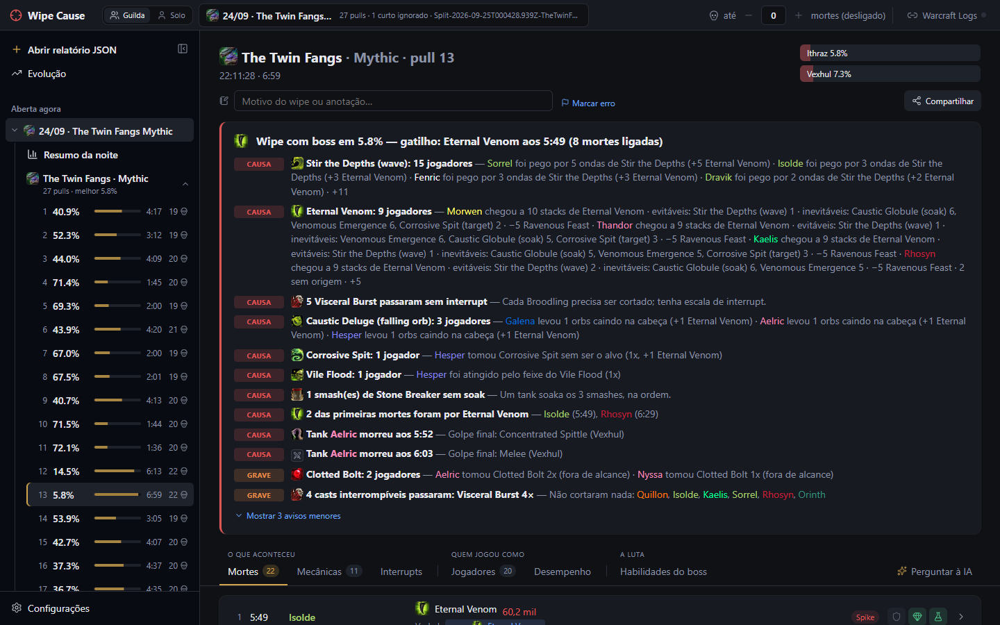
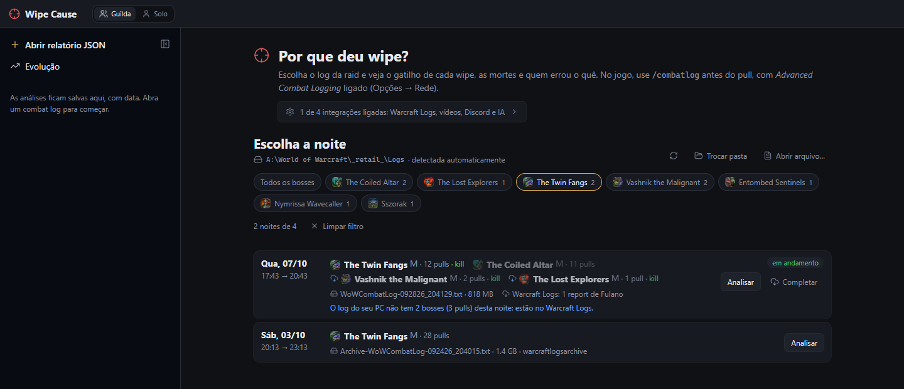
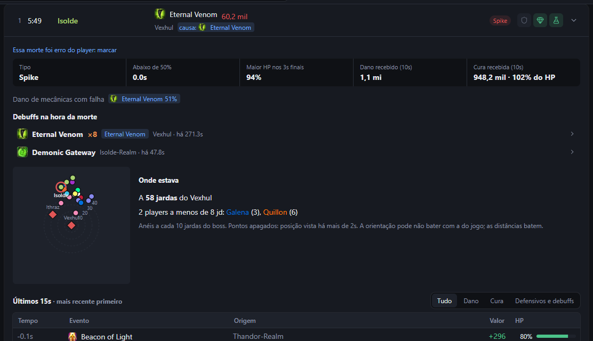
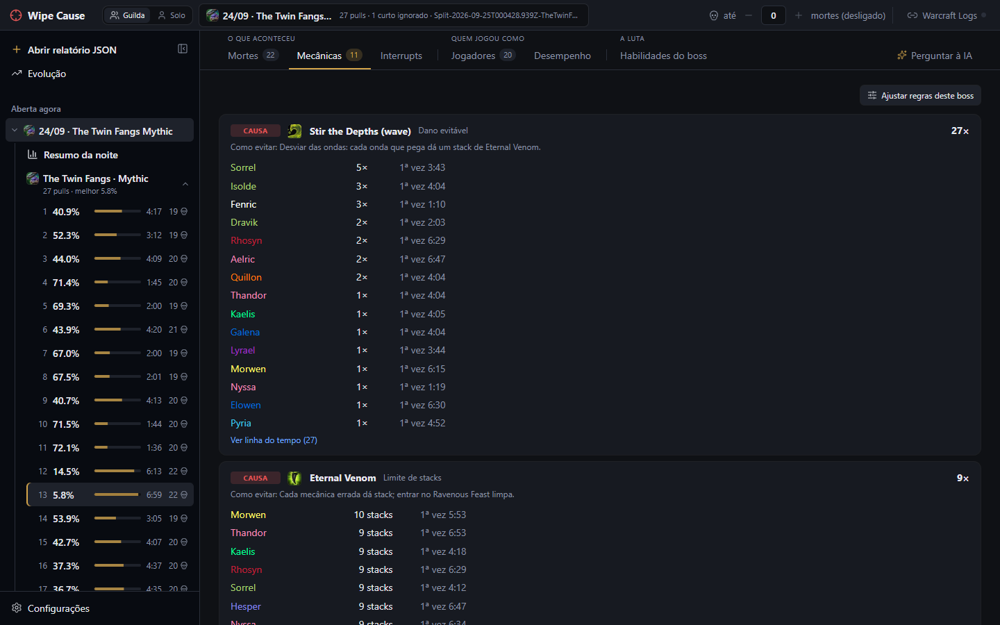
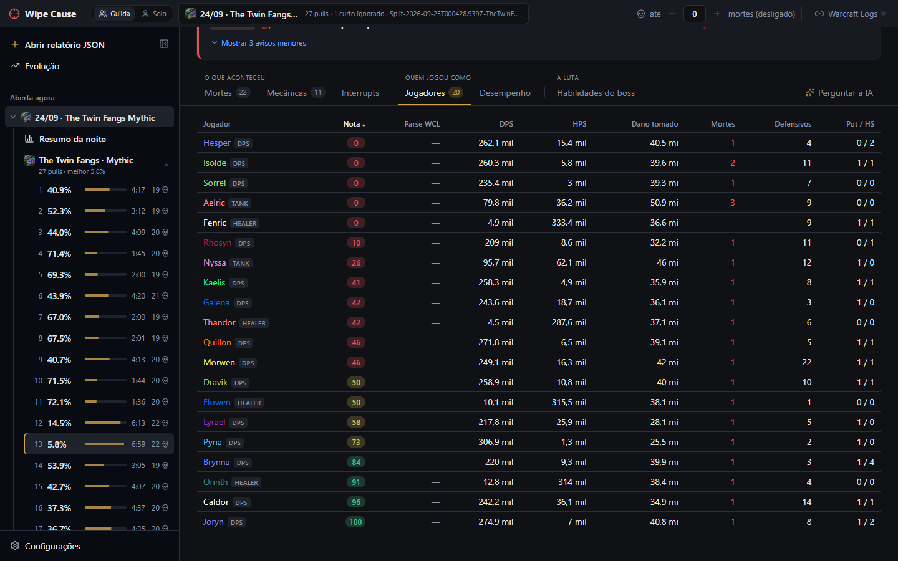
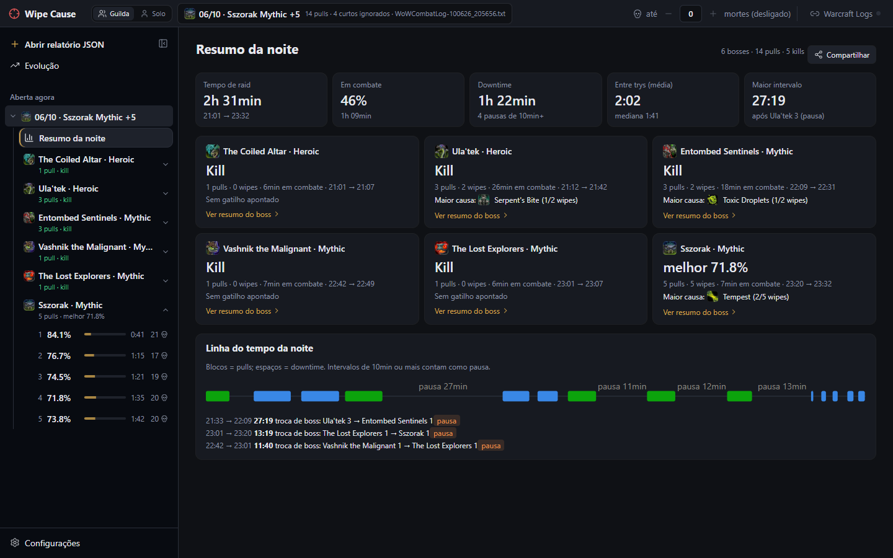
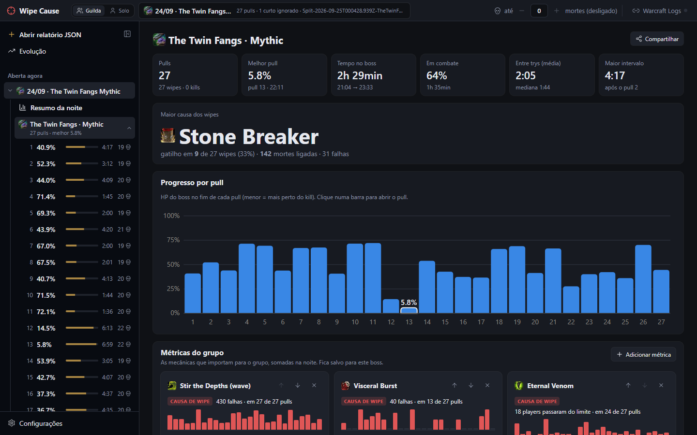
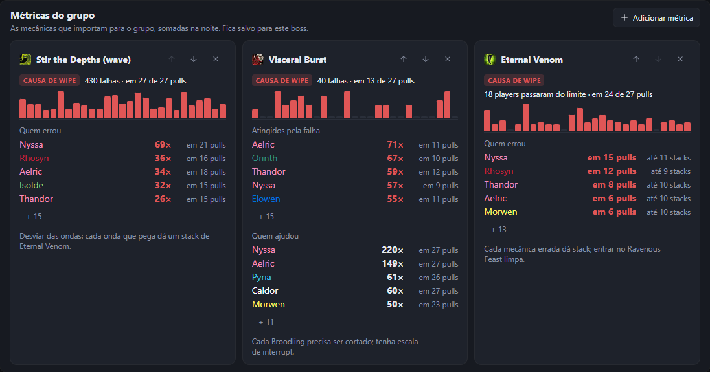
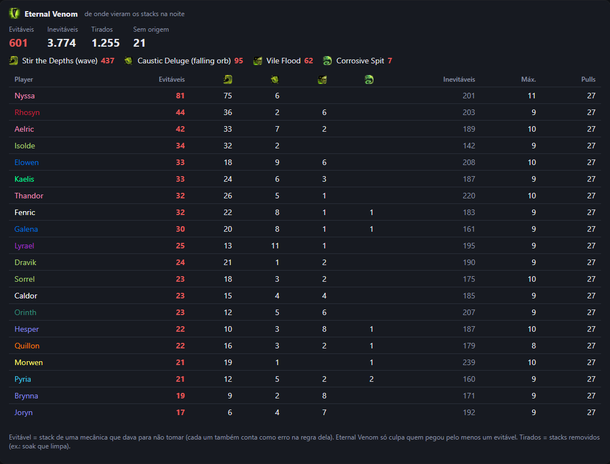
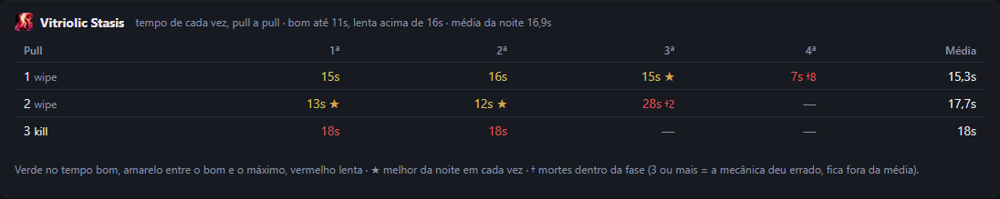

<p align="center">
  
</p>

<h1 align="center">Wipe Cause</h1>

<p align="center">
  <b>Descubra por que a try deu wipe.</b><br>
  Lê o combat log do World of Warcraft direto do seu PC e mostra o gatilho do wipe, cada morte e quem errou o quê.
</p>

<p align="center">
  <a href="https://github.com/keter45/wipe-cause/releases/latest"></a>
  
  
</p>

<p align="center">
  <a href="https://github.com/keter45/wipe-cause/releases/latest/download/WipeCause_x64-setup.exe"></a>
</p>
<p align="center">
  <a href="https://github.com/keter45/wipe-cause/releases/latest">Novidades da versão</a>
  &nbsp;·&nbsp;
  <a href="README.en.md">English</a>
</p>

<p align="center">
  
</p>
<p align="center"><i>Um pull do The Twin Fangs: o gatilho do wipe, as mecânicas que deram errado e quem errou cada uma.</i></p>

<p align="center">
  <a href="#instalar">Instalar</a> ·
  <a href="#como-funciona">Como funciona</a> ·
  <a href="#resumo-da-noite-e-do-boss">Resumo da noite e do boss</a> ·
  <a href="#mais-recursos">Mais recursos</a> ·
  <a href="#para-quem-contribui">Para quem contribui</a>
</p>

---

### 🎯 O gatilho do wipe
A falha de mecânica que puxou as mortes, com o momento exato e quem estava envolvido. Nada de adivinhar no Discord depois da raid.

### ☠️ Cada morte explicada
Spike ou morte lenta, se faltou cura, os debuffs ativos, o golpe final, os defensivos que sobraram e onde a pessoa estava.

### 📊 A noite inteira em uma tela
O progresso pull a pull, a maior causa dos wipes, o downtime entre as trys e as mecânicas que o grupo escolheu acompanhar.

### 🔴 Ao vivo, entre um pull e outro
Com o ao vivo ligado, o motivo do wipe aparece em segundos depois do pull — e pode ir sozinho para o Discord da raid.

---

## Instalar

1. **[Baixe o instalador](https://github.com/keter45/wipe-cause/releases/latest/download/WipeCause_x64-setup.exe)** (`WipeCause_x64-setup.exe`, ~4 MB).
2. Abra o arquivo. Na primeira vez, o Windows pode mostrar *"O Windows protegeu o computador"*: clique em **Mais informações → Executar assim mesmo** (o app ainda não tem certificado de assinatura pago).
3. Pronto. O app **se atualiza sozinho** quando sai versão nova; não precisa baixar de novo.

> [!TIP]
> Não tem servidor do Wipe Cause: tudo roda no seu PC. A conta do Warcraft Logs é opcional e só serve para ver os logs da guilda e completar o que o seu log não pegou.

### Primeiros passos

Na primeira vez, o app abre em **Configurações** com o passo a passo (depois ele fica em *Configurações → Como funciona*):

1. **Pasta de logs do WoW** — encontrada sozinha na maioria dos PCs (`World of Warcraft\_retail_\Logs`).
2. **No jogo** — em *Opções → Rede*, ligue o *Advanced Combat Logging*; antes do primeiro pull, `/combatlog` (ou o uploader do Warcraft Logs, que liga sozinho).
3. **Entrar com o Warcraft Logs** (recomendado) — com a sua conta o app vê os logs da sua guilda, completa o que faltou no seu log, liga o ao vivo sozinho e mostra o parse de cada um. Não precisa criar chave nem client.
4. **Opcional** — ligar o ao vivo quando o WoW abrir (com o app fechado, o jogo abre o Wipe Cause minimizado na bandeja e já ao vivo; um vigia leve, sem janela, inicia com o Windows), vídeos do Warcraft Recorder, Discord e IA.

## Como funciona

### 1. Escolha a noite


<p align="center"><i>Uma linha por noite, com os bosses de cada uma. O filtro mostra só as noites de um boss.</i></p>

**Nova análise** junta os logs do seu PC e os reports da guilda no Warcraft Logs, uma linha por noite. **Analisar** usa o log do seu PC (rápido, sem baixar nada); **Analisar todos** lê um por um os logs da lista que ainda não foram analisados e guarda no histórico, para a Evolução. A pasta de logs inclui a `warcraftlogsarchive` do uploader do Warcraft Logs. Logs só de masmorra (M+) não aparecem. **Guilda / Pug** separa a raid da guilda das raids com outros personagens e gente aleatória: pelo núcleo de players que se repete nas suas noites (um mesmo log pode ter os dois, separados boss a boss). Para achar as noites de um boss, filtre por ele (e pela dificuldade) na barra acima da lista; a escolha fica lembrada.

Bosses e pulls que **não estão no seu log** mas estão no Warcraft Logs (você saiu antes, entrou depois, estava longe) aparecem com o ícone de download. **Completar** baixa só o que falta — demora alguns minutos, então é você quem decide; depois do primeiro download, reabrir é rápido. Masmorras (M+) ficam de fora, e wipes com menos de 30s são ignorados.

### 2. Veja por que deu wipe

O topo do pull é o **veredito**: o boss em quanto ficou, o **gatilho** do wipe (a falha de mecânica que puxou as mortes) e cada erro de mecânica com quem errou, do mais grave para o mais leve (veja o print no topo desta página). Abaixo, as abas:

| Mortes | Mecânicas |
|---|---|
|  |  |
| Spike ou morte lenta, se faltou cura, debuffs ativos (com stacks), golpe final, defensivos/poção/healthstone e um mini mapa de onde todo mundo estava. | Cada mecânica do boss com quem errou, quantas vezes, a primeira vez e como evitar. |

- **Interrupts**: casts que passaram, quem cortou, quem tentou e errou, quem podia e não cortou — e, com a escala colada, de quem era a vez.
- **Jogadores**: dano causado e tomado, defensivos, poções e a **nota** de cada um.


<p align="center"><i>A nota de 0 a 100 desconta erros de mecânica, a vez perdida na escala de interrupts e a morte decisiva.</i></p>

## Resumo da noite e do boss


<p align="center"><i>O resumo da noite: tempo de raid, downtime entre as trys, um cartão por boss e a linha do tempo com as pausas.</i></p>

No **resumo do boss**: o melhor pull, a maior causa dos wipes, o progresso pull a pull, o placar de vilões e mocinhos e o downtime.



### Métricas do grupo

Escolha as mecânicas que importam para o grupo em **Adicionar métrica** (as que mais falharam vêm primeiro). Cada uma vira um cartão com as falhas pull a pull — clique numa barra para abrir o pull —, quem errou e quem ajudou. Dá para reordenar e tirar; a escolha fica salva para aquele boss.



### De onde vieram os stacks

Em debuffs que acumulam, como o Eternal Venom do The Twin Fangs, o app diz de onde veio cada stack: os **evitáveis** (onda, orb caindo em cima, Vile Flood, linha do Corrosive Spit), os inevitáveis e os que foram tirados. A regra só culpa quem pegou stack evitável.



### Tempo das intermissões

Fases em que o boss fica imune até o raid resolver a mecânica são cronometradas pull a pull, com o melhor da noite em cada vez.



## Mais recursos

### 🔴 Modo ao vivo e Discord

Com **Ao vivo** ligado (no topo), o app acompanha o `WoWCombatLog` mais recente da pasta de logs. Sem o WoW aberto neste PC e com a conta do Warcraft Logs, ele segue o log ao vivo da guilda (alguém precisa estar com o *Live Logging* do uploader ligado); com a opção *Ligar o ao vivo sozinho* (Configurações → Warcraft Logs), ele liga assim que a guilda começa a raid. Quando um pull termina, ele reanalisa o log em alguns segundos, abre o pull novo e mostra uma notificação — dá para ver o motivo do wipe antes do próximo pull.

Fechar a janela deixa o app na bandeja (perto do relógio), com o ao vivo rodando; clique no ícone para voltar e use **Sair** no menu do ícone para fechar de vez.

O aviso do pull tem um campo para anotar o motivo do wipe na hora, do jeito que a raid percebeu (ele não some enquanto você escreve). A anotação fica salva no PC, aparece no topo do pull (onde dá para editar depois), marca o pull na lista, vai no cartão de compartilhar e entra no contexto do "Perguntar à IA".

Em **Configurações → Discord**, cole o webhook do canal da raid. No modo ao vivo, tudo chega como imagem (o mesmo cartão do *Compartilhar*): em cada wipe, o motivo do wipe; em cada kill, o resumo do boss; e no fim da raid (ao vivo desligado ou 30 min sem pull novo), o resumo da noite. O pull, o resumo do boss e o resumo da noite também enviam na hora pelo *Compartilhar*. O botão **Discord** no topo pausa e religa o envio automático sem mexer nas opções (o *Compartilhar* continua funcionando).

### 📤 Compartilhar

O pull, o boss, a noite, o desempenho de um jogador e o modo solo têm **Compartilhar**: gera um cartão para **copiar como imagem** e colar no Discord/WhatsApp, **salvar como PNG, HTML ou PDF** ou **enviar a imagem ao Discord** pelo webhook configurado. Cada cartão tem duas versões:

- **Resumo** (padrão, e o que vai sozinho no ao vivo): o principal para uma olhada. No pull, o veredito, os 3 achados principais, as mortes decisivas, quem ficou abaixo de 80 e o mapa da falha; no boss, o HP de cada pull, as maiores causas, quem ficou abaixo de 80 e os destaques; no solo, os seus números contra a referência e os 3 erros que mais custaram.
- **Completo**: tudo aberto, mais largo. Cada morte em ordem, as mecânicas com quem errou, os interrupts que passaram e a tabela dos jogadores (pull); o pull a pull e o placar (boss e noite); os trechos em que a referência abriu vantagem, os cooldowns e o dano tomado a mais (solo); rotação, poções e setup (desempenho).

### 🧮 Nota por player

Cada player recebe uma nota de 0 a 100 por pull: parte de 100 e perde pontos por:

- **erros de mecânica**, pela gravidade da regra, até 3 por mecânica. Dano evitável de tank pesa metade, porque muitas vezes ele toma de propósito para segurar ou posicionar o boss;
- **deixar passar a própria vez** na escala de interrupts;
- **morte decisiva**, e mais se tinha defensivo sobrando.

No fim pesam o tempo vivo até a primeira morte e, no kill, o **parse do Warcraft Logs**: de 50 (a mediana) para cima não perde nada; abaixo perde proporcional, até 30% (parse 25 perde 15%). Wipe não tem parse, então fica sem essa parte. O parse é buscado uma vez (com o report da noite cadastrado e a conta do Warcraft Logs conectada) e fica salvo no app. Morte em **wipe geral** (mais de 5 mortes em até 1,5s — explosão, Execution, enrage) não conta: é consequência do wipe, e a culpa fica com a mecânica e quem a causou. Aparece na aba Jogadores (passe o mouse para ver os descontos), como média no placar do boss e por noite na Evolução.

### 🤖 Perguntar à IA

Cada pull tem a aba **Perguntar à IA**: a IA recebe um dossiê do pull (mecânicas do boss com as dicas das regras, veredito, mortes, defensivos, posições, escala de interrupts, dispels, notas e um resumo dos outros pulls da noite — ~3–5 mil tokens) e responde só com base nele. Dá para ver o dossiê em **Ver dossiê**.

Funciona com qualquer provedor no formato de chat da OpenAI, com presets para opções gratuitas: **Google Gemini** e **Groq** (planos gratuitos sem cartão), **OpenRouter** (modelos `:free`) e **Ollama** (roda no seu PC, grátis e offline), escolhidos em **Configurações → Perguntar à IA**. A chave de API fica no Gerenciador de Credenciais do Windows. Nos planos gratuitos, o provedor pode usar as perguntas para treinar modelos — o dossiê inclui os nomes dos players.

### ⚡ Desempenho

A aba **Desempenho** de cada pull compara um player com os **top players da mesma spec no Warcraft Logs**, com item level parecido (e tempo de kill parecido, se o pull foi kill). Na progressão não há tempo de kill: o fight do top é recortado no mesmo tempo que o player ficou vivo, então um wipe de 2:30 é comparado com os 2:30 iniciais do kill.

- **Janelas de burst**: marque os cooldowns que quer comparar; cada uso mostra os casts de 3s antes a 20s depois numa linha do tempo, lado a lado com o mesmo uso do top.
- **Cooldowns**: quando cada um foi usado, quantas vezes (e quantas cabiam no tempo) e se o 1º uso veio atrasado ou adiantado.
- **Onde a referência abriu vantagem**: o seu dano a cada 5s contra o da referência, com os 3 trechos de maior diferença e os casts de cada um lado a lado.
- **Casts por habilidade**: casts por minuto e % do dano de cada habilidade, e a leitura da [rotação base da spec](#-rotação).
- **Dano tomado a mais**: as habilidades do boss que pegaram bem mais em você que na referência, por minuto vivo.
- **Setup**: poção de combate, distribuição de status, talentos diferentes e itens lado a lado, com encantamentos e gemas que faltam.
- **Exportar**: o relatório do jogador vira um cartão para copiar, salvar (PNG/HTML) ou mandar ao Discord — para quem não tem o app.

Para usar os tops, crie um client grátis em [warcraftlogs.com/api/clients](https://www.warcraftlogs.com/api/clients/) e cole o client ID e o secret na aba (ficam no Gerenciador de Credenciais do Windows). As consultas enviam só boss, spec e códigos de report; as respostas ficam em cache. A comparação com a própria raid fica na aba **Na própria raid**. Se o link do report da noite estiver cadastrado, o pull também ganha links para o seu fight no Warcraft Logs e no WoWAnalyzer.

### 👤 Modo solo

No topo, **Guilda / Solo** troca o foco do app. No modo guilda, a pergunta é por que a raid wipou. No solo, é como **você** pode melhorar. "Você" é quem gravou o log; na análise do Warcraft Logs, ou para ver outro personagem, escolha na própria tela.

- **Pull → aba Você**: o que corrigir, por assunto:
  - **Para o próximo pull:** os seus erros ordenados pelo que custaram, cada um com o momento (▶ no vídeo) e o que fazer.
  - **Sobrevivência e mecânicas:** as suas mortes e erros de mecânica, e os defensivos que os tops da spec usam nas mecânicas deste boss.
  - **Rotação:** a leitura da [rotação base da spec](#-rotação), com os tops do mesmo boss em cada item.
- **Pull → aba Comparação detalhada**: você contra uma referência (um top da spec no Warcraft Logs, alguém da raid ou você em outro pull), com tudo da aba [Desempenho](#-desempenho).
- **Resumo da noite e do boss**: os seus pulls boss a boss, o melhor de cada um e os erros que se repetem.
- **Evolução**: um boss ao longo das noites salvas: o seu melhor output, a rotação, as mortes e os erros de mecânica por pull.

### 📜 Rotação

Cada spec pode ter a **rotação base escrita** em `rotations/<classe>-<spec>.yaml` (pontos principais, prioridade por árvore de herói em alvo único e AoE, abertura e checagens), feita a partir do guia de rotação do Wowhead e da APL do SimulationCraft do patch e calibrada nos logs dos melhores players do mundo de cada spec (o que nem eles cumprem sai). Na aba **Desempenho** (e na aba **Você** do modo solo), o log do player é lido contra ela: aproveitamento (0–100), os erros claros e os ajustes, com o momento de cada um (▶ no vídeo), a abertura e o uso dos cooldowns.

**Comparado com os tops neste boss:** o app traz embutida a mediana dos melhores players do mundo da spec em cada boss do raide. Cada item da rotação mostra o seu número ao lado do deles; a **abertura** é a dos tops naquele boss e na sua árvore de herói (ela muda de boss para boss e com os talentos), comparada com a sua; e aparecem também: a habilidade que eles usam bem mais ou menos naquele boss (AoE x alvo único), o cooldown que eles seguram para depois (ou soltam no pull), o momento da poção e onde você parou depois de uma mecânica do boss enquanto eles continuaram castando.

**Procs e cooldowns, como os tops decidem:** o app descobre nos logs dos tops quem gasta cada proc (Art of War → Blade of Justice, Divine Resonance → Hammer of Wrath...) e quais cooldowns eles soltam juntos, e aponta onde você decide diferente: o proc que você deixa acabar bem mais que eles ("Divine Resonance: você deixou acabar 51% (tops 0%)"), as outras habilidades que você casta com o proc esperando, o cooldown que eles usam assim que fica pronto e você segura, e o que eles alinham (Avenging Wrath junto do Wake of Ashes) e você não, com o ▶ de cada momento. Segurar para uma fase muda de boss para boss: com tops suficientes no boss, a comparação dos cooldowns é a daquele boss. Só aparece o que passa bem do que os próprios tops fazem, e proc que você nunca gastou (outro build) não é cobrado.

**O contexto da luta:** a rotação é comparada separada nos trechos em que você acertava 1 inimigo e nos de AoE (3 ou mais), com os tops daquele boss: "AoE: os tops usam Divine Storm em 80% dos casts; você em 20%". Pull bem mais curto que a luta dos tops (wipe numa fase do começo) não compara a mistura. Buffs e debuffs que os tops mantêm o tempo todo pela rotação (não os de equipamento) viram checagem de uptime sozinhos. E quando um talento muda a rotação dos tops em todos os bosses (não só nos de AoE, onde quem muda é a luta), quem joga esse build é comparado com os tops do mesmo build.

Na comparação da aba **Desempenho**, as mesmas decisões também são comparadas com a referência escolhida, alguém da raid ou um top do Warcraft Logs (o app baixa também os buffs dele): "Explosive Shot: depois de pronto, você leva 8.8s para usar, em média (Bettaozor 1.3s)". Com um log só não há como saber o que é normal, então aparece só diferença grande entre os dois e que também passa do que os tops fazem: o que dois bons players fazem diferente entre si é estilo, não erro.

Specs com rotação: todas as de dano — **Death Knight** (Frost, Unholy), **Demon Hunter** (Havoc, Devourer), **Druid** (Balance, Feral), **Evoker** (Devastation, Augmentation), **Hunter** (Beast Mastery, Marksmanship, Survival), **Mage** (Arcane, Fire, Frost), **Monk** (Windwalker), **Paladin** (Retribution), **Priest** (Shadow), **Rogue** (Assassination, Outlaw, Subtlety), **Shaman** (Elemental, Enhancement), **Warlock** (Affliction, Demonology, Destruction) e **Warrior** (Arms, Fury).

### 🛠️ Ajustar as regras do boss

Cada raid tem sua estratégia, então as regras dos bosses podem ser ajustadas sem mexer em arquivo:

- **Ajustar regras deste boss** (aba Mecânicas): ligar/desligar cada mecânica, mudar a gravidade, quantos hits por player são tolerados, com quantos stacks avisar, o tempo máximo até o dispel, quem pode ser culpado e os textos de dica e mensagem. Só o que muda em relação ao padrão é salvo, então os ajustes continuam valendo quando o app atualiza as regras.
- **Foco da progressão (★)**: as mecânicas que estão segurando a progressão entram no veredito mesmo quando leves, vêm primeiro e pesam 1,5× na nota.
- **Criar regra** (aba Habilidades do boss): para algo que as regras não pegam, escolha em linguagem simples o que aquela habilidade significa ("tomar isso é erro", "tem que ser cortado", "stack que mata"…); a prévia mostra o que ela marcaria no pull.
- **Marcar erro**: para o que o log não prova (posição, bait, escala), marque no pull quem errou e o quê — ou "essa morte foi erro do player" no detalhe da morte. Entra no veredito, na nota e no contexto da IA.
- **Exportar / Importar**: mande os ajustes de um boss para os officers usarem a mesma configuração.

Salvar reanalisa o log aberto. Os ajustes ficam em `rule-tuning/<encounter>.json` na pasta de dados do app (`wipe-cli analyze <log> --tuning <pasta>` também aplica).

### ✋ Escala de interrupts, dispels e mecânicas especiais

Na aba **Interrupts**, cole a nota do MRT/NSRT (ou escreva `Cast: Fulano, Ciclano, Beltrano`, uma linha por add): o app confere cast a cast de quem era a vez, quem cortou, quem cobriu e em que vez o cast passou — e o veredito do pull e o Discord passam a apontar quem deixou passar.

As regras também cobrem:

- **`dispel`**: o tempo até o dispel de cada debuff e quem ficou sem.
- **`phase_duration`**: fases cronometradas, como o puzzle do Vitriolic Stasis no Entombed Sentinels.
- **Debuff acumulativo com fontes**: de onde veio cada stack (ex.: Eternal Venom no The Twin Fangs).
- **`exclusive_auras`**: quem pegou duas auras que não podem andar juntas. Ex.: Mark of Acid e Mark of Blood no Entombed Sentinels, quando alguém chega perto do outro boss no meio da luta; a troca de lado depois da intermissão não conta.

### 📍 Posições

Com Advanced Combat Logging, cada morte (antes do corte) guarda onde todo mundo estava: o detalhe da morte mostra um mini mapa, a distância até o boss e quem estava a menos de 8 jardas. As falhas coletivas de mecânica (ex.: detonação do orb roxo, Execution da Guillotine) também guardam a foto do momento.

No Coiled Altar Mythic, o app reconstrói onde estava cada orb (quem carregava, onde cada um caiu, quais o Sever quebrou) e, em cada detonação, aponta quem levou um orb até outro parado no chão: "Rainface levou o roxo a 7 jardas de um verde no chão". Quando ninguém chegou perto (ex.: sobrou roxo no tempo), não culpa ninguém.

### 📈 Evolução

Na barra lateral, **Evolução** compara todas as noites salvas de um boss: melhor pull por noite, a % dos wipes em que cada mecânica foi o gatilho (dá para ver se o erro está diminuindo) e, por player, mortes por pull, nota e parse em cada noite, o que mais o mata e quantas dessas mortes tinham defensivo sobrando. Usa só a raid da guilda (dá para incluir os pugs). Mostra também **quem está melhorando e quem está piorando** (começo x fim das noites em que cada um jogou) e, na **progressão** (os wipes antes da primeira kill), a melhor e a pior nota nos wipes e o melhor e o pior parse na kill.

### 🌐 Warcraft Logs

Com a conta do Warcraft Logs, os reports da sua guilda (inclusive os não listados) aparecem em **Nova análise**, junto dos logs do PC; um link de fora da lista pode ser colado no fim da tela. O que estiver num log do seu PC sai dele; do Warcraft Logs só se baixa o que falta (os eventos baixados ficam no disco, para reanalisar sem gastar a API). Várias pessoas subiram a mesma noite? Os reports viram uma análise só, com uma cópia de cada pull.

Cole o link do report da noite na barra do Warcraft Logs (fica salvo para aquele arquivo de log). Cada pull ganha um botão que abre o report já filtrado no boss e na dificuldade, com o número da try como o WCL mostra ("Wipe 13") — ele conta também os pulls curtos que o app ignora. Isso não usa a API nem pede login.

### 🎥 Warcraft Recorder

Se você grava as lutas com o [Warcraft Recorder](https://warcraftrecorder.com), cadastre a pasta dos vídeos (**Configurações → Vídeos do Warcraft Recorder**, ou o botão **Vídeos** no topo). Sem cadastro, o app tenta detectar a pasta pela configuração do Recorder e casa cada vídeo com o pull pelo boss e horário de início. No pull aparece o botão **▶ Vídeo**, e cada morte, gatilho e evento de mecânica ganha um **▶** que abre o vídeo 5s antes do momento.

**Vídeos da guilda (nuvem do Recorder):** em *Configurações → Vídeos*, entre com a conta da nuvem do Warcraft Recorder. Os vídeos que a guilda sobe viram outros pontos de vista de cada pull: no player, troque de POV e o vídeo continua no mesmo segundo.

### ⚙️ Configurações

Tudo o que o app precisa fica em **Configurações** (rodapé da barra lateral), cada item com o status (pronto, falta configurar, desligado):

- **Essencial:** a pasta de logs do WoW e o combat log no jogo (`/combatlog` + Advanced Combat Logging — o app avisa se o log aberto veio sem ele).
- **Análise:** o corte de mortes padrão para logs novos.
- **Integrações opcionais:** Warcraft Logs, pasta de vídeos do Warcraft Recorder, webhook do Discord e o provedor do "Perguntar à IA".
- **Sobre:** versão, atualizações e a pasta das regras de boss.

Quando um recurso depende de uma integração que ainda não foi ligada, ele mostra um atalho que abre a seção certa.

**Ignorar após N mortes** (topo da tela; o padrão, 4, fica em Configurações): depois de algumas mortes o wipe já está decidido. Erros de mecânica, falhas, interrupts e o gatilho só contam até a N-ésima morte de cada pull; o resto aparece esmaecido. Mudar o N é instantâneo (0 = conta tudo).

### 🗣️ Idiomas

O app é em português (Brasil) e inglês: o idioma vem do sistema na primeira vez e troca em **Configurações**, na hora e sem perder o que está aberto. A análise, as dicas das regras, a rotação, os cartões de compartilhar, as mensagens do Discord, o dossiê da IA e o menu da bandeja seguem o idioma escolhido. Nomes de habilidades, bosses e mecânicas ficam em inglês nos dois, como vêm do jogo.

## Para quem contribui

### Estrutura

| pasta | o quê |
|---|---|
| `crates/wipe-core` | parser do combat log e análise dos pulls (Rust, sem dependência de UI) |
| `src-tauri` | app desktop (Tauri) que expõe o `wipe-core` para a UI |
| `src` | interface (React + TypeScript) |
| `encounters/` | regras por boss (YAML), geradas pela skill `boss-rules` |
| `rotations/` | rotação base por spec (YAML) |
| `data/` | tabelas editáveis: defensivos por classe, consumíveis |
| `docs/screenshots/` | os prints deste README (`pt/` e `en/`) |

### Desenvolvimento

Pré-requisitos: Node 20+, Rust (rustup) e MSVC Build Tools (Windows).

```bash
npm install
npm run tauri dev
```

Rodar só o analisador, sem UI:

```bash
cargo run -p wipe-core --bin wipe-cli -- analyze caminho/do/WoWCombatLog.txt
```

Para testar o ao vivo sem estar em raid: `node scripts/simulate-live.mjs <log antigo> <pasta Logs>` escreve alguns pulls de um log real, aos poucos, num `WoWCombatLog` novo.

### Textos nas duas línguas

Todo texto novo entra em português e inglês na mesma mudança.

- **Interface:** os textos ficam em dicionários (`*.i18n.ts`, com `defineMessages(pt, en)`); o inglês é tipado contra o português, então faltar uma frase não compila. Um teste falha se aparecer português fora dos dicionários, e outro se o lado inglês de um dicionário tiver português.
- **Regras de boss e rotações (YAML):** dicas, mensagens, títulos e notas são `{ pt: "...", en: "..." }`; os nomes ficam em inglês. O teste do `wipe-core` confere as duas coisas.
- **Notas de versão:** uma seção `## Português` e uma `## English` (o app mostra a do idioma escolhido).

<details>
<summary><b>Atualizar tudo depois de patch, raide nova ou nerf</b></summary>

`npm run refresh` refaz sem IA tudo o que muda com o jogo: baixa a APL do SimulationCraft (e marca as specs em que ela mudou), roda os tops de cada spec pelo motor, ajusta só os números das rotações (metas de uptime e de uso de cooldown pelo quartil de baixo dos tops; id novo da mesma habilidade em `alt_ids`; evento repetido do mesmo botão em `ignore_casts`), gera a referência dos tops por boss e escreve um relatório em `samples/refresh/<data>.md` com cada spec **OK**, **ATENÇÃO** ou **REVISAR**.

- `npm run refresh -- --tops`: baixa os tops antes (credenciais por variável de ambiente, `samples/wcl-credentials.env`, fora do git, ou o cofre do app; com mais de um cliente no arquivo, troca quando os pontos por hora acabam).
- `npm run refresh -- --tops --zone latest --fresh`: raide nova; os chefes vêm da zona mais nova do Warcraft Logs (sem regras escritas) e os tops do raide anterior saem da referência.
- `npm run refresh -- --dry <spec>`: só o relatório, sem mudar nada.

REVISAR é o que muda o que a spec é (habilidade que os tops pararam de usar, habilidade nova, APL nova, checagem que nem os tops cumprem): a skill `rotation-refresh` do Claude Code cuida disso.

</details>

<details>
<summary><b>Gerar a rotação de uma spec</b></summary>

Sem escrever à mão nem usar IA: `scripts/rotation.mjs` monta o YAML a partir da APL e dos dados de spell do SimulationCraft e calibra nos logs dos tops do Warcraft Logs.

1. `node scripts/rotation.mjs tops <spec>`: baixa os 2 melhores parses de cada chefe do raide (sem buffs externos), só com os eventos do player. Usa as variáveis de ambiente `WCL_CLIENT_ID` e `WCL_CLIENT_SECRET`.
2. `node scripts/rotation.mjs calibrate <spec>`: gera o rascunho e o roda nos tops pelo próprio motor do app.
   - **Prioridade:** sai da APL, por árvore de herói, em alvo único e AoE.
   - **Ids:** vêm do que os tops castam.
   - **Números:** cooldown, cargas e cast vêm do dump do SimC (ou do tooltip do Wowhead).
   - **Checagens inferidas:** DoT, pelo `dot.X.refreshable`; proc, pelo `buff.X.react` numa spell que o buff modifica; recurso, pelo custo dos gastos; cooldowns de 20s ou mais.
   - **Calibração pelos tops:** metas de uptime e de uso de cooldown pelo que os tops fazem; abertura, pelo que 70% deles casta nos primeiros segundos; sai o que nem os tops cumprem.
   - **Destino:** escreve em `rotations/`; se já existe uma escrita à mão, vai para `samples/rotation/` para comparar.
3. `node scripts/rotation.mjs check <spec>`: mostra como os tops se saem na rotação atual, para validar uma escrita à mão.

Tipos de checagem: `proc` (buff que precisa ser gasto, carga por carga — ex.: Precise Shots, Demonic Core), `requires_buff` (casts que pedem um buff — ex.: Trick Shots, Demonbolt com Demonic Core), `downtime` (tempo sem castar, só quando a raid estava batendo), `cooldown` (usos vs. possíveis no tempo vivo), `resource_waste` (recurso estourado, ex.: Maelstrom, Astral Power, Soul Shards), `dot_uptime` (DoT no alvo, ex.: Flame Shock), `aoe_swap` (com N+ alvos o cast deveria ser outro, ex.: Chain Lightning) e `after_cast` (cast que precisa vir logo antes ou depois de outro, ex.: Demonic Tyrant com os Dreadstalkers fora).

Os textos saem em modelo ("X perdido: use antes de acabar"): vale revisar os pontos principais antes de publicar.

</details>

<details>
<summary><b>Versões e atualização automática</b></summary>

Versões seguem semver. Cada feature grande é fechada em uma release (`vX.Y.Z`) depois de aprovada.

O app instalado procura versão nova ao abrir (e a cada 6h): lê o `latest.json` da última release do GitHub, baixa o instalador, confere a assinatura e reinstala sozinho. Na barra lateral, "Procurar atualizações" força a checagem.

Publicar uma versão:

1. Suba a versão em `Cargo.toml`, `package.json` e `src-tauri/tauri.conf.json`.
2. `npm run release:build` — build assinado com a chave privada em `~/.tauri/wipe-cause.key` (fora do repo; sem ela não dá para publicar atualizações, guarde um backup).
3. `node scripts/release.mjs notas.md` (com as seções `## Português` e `## English`) — gera `target/release/upload/` com o instalador (com a versão no nome e uma cópia `WipeCause_x64-setup.exe`, que é o link de download deste README) e o `latest.json`, e mostra o `gh release create` para publicar os três.

</details>

<details>
<summary><b>Prints deste README</b></summary>

Os prints saem de relatórios reais com os nomes dos personagens trocados por nomes fictícios. Ficam em `docs/screenshots/pt/` e `docs/screenshots/en/`, um conjunto por idioma, em 1440×900.

</details>
